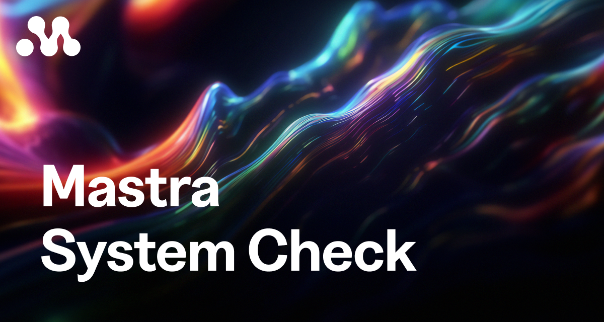

# Mastra System Check



A comprehensive Claude Code skill for validating Mastra AI agent projects. This skill performs **66 checks** across **10 categories** to identify configuration issues, missing best practices, and potential problems before they cause runtime errors.

## Installation

### Option 1: npx (Recommended)

```bash
npx mastra-system-check
```

### Option 2: One-line install

```bash
curl -fsSL https://raw.githubusercontent.com/goldk3y/mastra-system-check/main/install.sh | bash
```

### Option 3: Git clone

```bash
git clone https://github.com/goldk3y/mastra-system-check.git ~/.claude/skills/mastra-system-check
```

### Option 4: Manual

Download and copy this directory to:
```bash
~/.claude/skills/mastra-system-check/
```

### Verification

The skill will automatically activate when working with Mastra projects. You can verify installation by asking Claude Code to perform a system check on your Mastra project.

---

## What It Checks

### Priority Levels

| Badge | Level | Description | Action |
|-------|-------|-------------|--------|
| 🔴 | **CRITICAL** | System won't function | Fix immediately |
| 🟠 | **HIGH** | Major functionality issues | Fix before deployment |
| 🟡 | **MEDIUM** | Quality and maintainability | Fix when possible |
| 🟢 | **LOW** | Performance and cost | Nice to have |

### Check Categories

| # | Category | Rules | Priority | Key Checks |
|---|----------|-------|----------|------------|
| 1 | Configuration & Setup | 6 | 🔴 CRITICAL | Storage, env vars, TypeScript, entry points |
| 2 | Agent Configuration | 6 | 🟠 HIGH | Model format, instructions, tools, memory |
| 3 | Workflow Configuration | 6 | 🟠 HIGH | .commit(), schemas, steps, error handling |
| 4 | Context & Data Flow | 8 | 🟠 HIGH | Type safety, middleware, propagation |
| 5 | Prompt Engineering | 10 | 🟠 HIGH | Structure, token efficiency, examples |
| 6 | Memory Configuration | 6 | 🟡 MEDIUM | Storage, threads, vector stores |
| 7 | Tool Configuration | 6 | 🟡 MEDIUM | Schemas, descriptions, error handling |
| 8 | Observability & Evals | 6 | 🟡 MEDIUM* | Tracing, exporters, scorers |
| 9 | Security & Guardrails | 6 | 🟡 MEDIUM | Auth, CORS, PII, prompt injection |
| 10 | Performance & Optimization | 6 | 🟢 LOW | Model selection, caching, batching |

*\*Observability checks are **conditional** - only run if telemetry/evals are configured.*

---

## Usage

### Trigger Keywords

The skill activates when you say any of these phrases:

| Category | Example Phrases |
|----------|-----------------|
| **General Check** | "check my mastra project", "mastra system check", "validate mastra" |
| **Setup Issues** | "mastra not working", "agent won't start", "can't find mastra instance" |
| **Memory Issues** | "memory not persisting", "conversation lost", "agent forgets context" |
| **Workflow Issues** | "workflow stuck", "workflow not executing", "steps not running" |
| **Context Issues** | "context not propagating", "requestcontext empty" |
| **Deployment** | "prepare for production", "production checklist", "deploy mastra" |

### Quick Check Commands

Ask Claude to run specific checks:

```
Run a Mastra system check on this project
```

```
Check my Mastra agent configurations
```

```
Validate my workflow setup
```

```
Review my memory configuration for issues
```

```
Is my Mastra project ready for production?
```

### Output Format

For each issue found:

```
### 🔴 CRITICAL Issues (count)

**[rule-id] Rule Name**
- **Location:** `file/path.ts:lineNumber`
- **Issue:** Clear description of what's wrong
- **Fix:**
  ```typescript
  // Corrected code example
  ```
- **Docs:** https://mastra.ai/docs/relevant-section
```

---

## Quick Checks (Run First)

Before deep analysis, the skill verifies these **4 common issues** that cause most failures:

| Check | Command | Fix |
|-------|---------|-----|
| Storage configured? | `grep "storage:" src/mastra/index.ts` | Add LibSQLStore |
| API keys set? | `cat .env \| grep API_KEY` | Add to .env |
| Model format correct? | All models use `provider/model-name` | Fix format |
| Workflows committed? | Every workflow ends with `.commit()` | Add .commit() |

---

## Most Common Issues

These are the issues most frequently caught by the system check:

1. **Missing storage provider** - Memory and workflows won't persist
2. **Missing API keys** - Agent calls fail at runtime
3. **Wrong model format** - Should be `provider/model-name` (e.g., `openai/gpt-4o`)
4. **No thread/resource in memory calls** - Messages aren't tracked
5. **Untyped RequestContext** - No type safety across components
6. **Security processors not first** - PII stored before redaction
7. **Missing .commit() on workflows** - Workflow won't execute

---

## Quick Fixes

### Essential Setup

```typescript
// src/mastra/index.ts
import { Mastra } from "@mastra/core";
import { LibSQLStore } from "@mastra/libsql";

export const mastra = new Mastra({
  storage: new LibSQLStore({
    id: "mastra-storage",
    url: process.env.DATABASE_URL || "file:./mastra.db",
  }),
  agents: { /* your agents */ },
});
```

### Environment Variables

```bash
# .env
OPENAI_API_KEY=sk-...
ANTHROPIC_API_KEY=sk-ant-...
DATABASE_URL=file:./mastra.db
```

### TypeScript Configuration

```json
{
  "compilerOptions": {
    "target": "ES2022",
    "module": "ES2022",
    "moduleResolution": "bundler",
    "strict": true,
    "esModuleInterop": true,
    "skipLibCheck": true
  }
}
```

### Model Format

```typescript
// ❌ Wrong
model: "gpt-4o"

// ✅ Correct  
model: "openai/gpt-4o"
```

### Workflow Commit

```typescript
// ❌ Wrong - missing .commit()
const workflow = new Workflow({ id: "my-flow" })
  .step("step1", { execute: async () => ({ done: true }) });

// ✅ Correct
const workflow = new Workflow({ id: "my-flow" })
  .step("step1", { execute: async () => ({ done: true }) })
  .commit();  // Required!
```

---

## File Structure

```
mastra-system-check/
├── SKILL.md          # Skill metadata, triggers, and execution steps
├── AGENTS.md         # Complete 66-rule guide with examples
├── metadata.json     # Version and feature info
├── README.md         # This file
├── assets/
│   └── banner.png    # Header image
├── bin/
│   └── install.js    # npx installer
├── install.sh        # Shell installer
└── rules/
    ├── _sections.md  # Category hierarchy
    ├── _template.md  # Template for new rules
    ├── config-*.md   # Configuration checks (CRITICAL)
    ├── agent-*.md    # Agent checks (HIGH)
    ├── workflow-*.md # Workflow checks (HIGH)
    ├── context-*.md  # Context checks (HIGH)
    ├── prompt-*.md   # Prompt checks (HIGH)
    ├── memory-*.md   # Memory checks (MEDIUM)
    ├── tool-*.md     # Tool checks (MEDIUM)
    ├── observability-*.md  # Observability checks (MEDIUM)
    ├── security-*.md       # Security checks (MEDIUM)
    └── optimization-*.md   # Optimization checks (LOW)
```

---

## Version History

| Version | Changes |
|---------|---------|
| **1.1.0** | Enhanced skill activation with keyword triggers, quick checks, explicit execution steps, improved output format with examples |
| **1.0.0** | Initial release with 66 rules across 10 categories |

---

## Contributing

To add new rules:

1. Copy `rules/_template.md` to a new file with the appropriate prefix
2. Fill in the frontmatter (title, impact, tags, category)
3. Write clear "What to Check", "Incorrect", "Correct", and "How to Fix" sections
4. Update `rules/_sections.md` if adding a new category

---

## References

- [Mastra Documentation](https://mastra.ai/docs)
- [Mastra GitHub](https://github.com/mastra-ai/mastra)
- [AI SDK Documentation](https://sdk.vercel.ai/docs)
- [Anthropic Prompt Engineering](https://www.anthropic.com/engineering/effective-context-engineering-for-ai-agents)

---

## License

MIT
